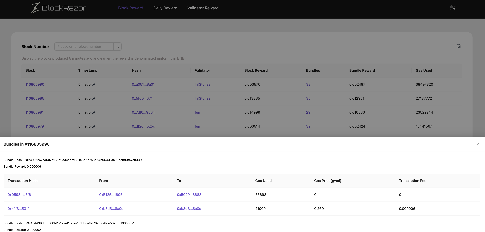

# BSC Block Builder Bundle 瀏覽器


Bundle瀏覽器和Bundle Trace服務捆綁銷售，採購Bundle Trace服務的用戶可在[登錄](https://blockrazor.io/#/login)BlockRazor控制台訪問Bundle 瀏覽器


### 產品定義

BSC Bundle Explorer 是 BlockRazor 面向 BSC Block Builder 生態提供的區塊與 Bundle 數據瀏覽工具。

它從區塊、日期和驗證者三個維度呈現區塊獎勵與 Bundle 獎勵，並支援查看區塊內的 Bundle 及交易組成，幫助 Searcher、Builder、驗證者和研究人員理解 Bundle 的鏈上執行情況與獎勵表現。

### 核心能力

#### Block Reward

查看 BSC 區塊、驗證者、區塊獎勵、Bundle 數量與 Bundle 獎勵。使用者可以按區塊高度查詢，並展開單個區塊中的 Bundle 和交易明細，包括交易地址、Gas 使用量、Gas Price 與交易費用。

<figure><figcaption></figcaption></figure> <figure><figcaption></figcaption></figure>

#### Daily Reward

按日匯總區塊數量、Bundle 數量、區塊獎勵、Bundle 獎勵及當日最高 Bundle 獎勵，便於觀察 BSC Bundle 活躍度與獎勵變化。

<figure><figcaption></figcaption></figure>

#### Validator Reward

按指定日期查看不同驗證者的區塊獎勵與 Bundle 獎勵，幫助使用者比較驗證者的獎勵表現與構成。

<figure><figcaption></figcaption></figure>

### 適用場景

* **Searcher 策略復盤**：確認 Bundle 是否進入區塊，查看 Bundle 內的交易組成及 0 Gwei 交易。
* **Builder 與驗證者分析**：比較區塊獎勵和 Bundle 獎勵，了解不同驗證者的表現。
* **鏈上數據研究**：追蹤每日 Bundle 數量與獎勵變化，觀察 BSC Bundle 市場活躍度。
* **問題定位**：從區塊高度逐層定位到 Bundle 和交易，快速核對鏈上執行結果。

### 產品價值

BSC Bundle Explorer 將分散在區塊、Bundle、交易和驗證者層級的數據集中展示，降低鏈上查詢與人工整理成本。使用者可以更快完成策略復盤、獎勵分析與問題排查，並以統一視角理解 BSC Block Builder 生態中的 Bundle 活動。

### 數據說明

* 獎勵數值統一以 BNB 顯示。
* Block Reward 展示生成時間距現在 5 分鐘及以上的區塊。
* Daily Reward 數據每 24 小時更新一次。
