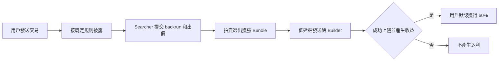

# BSC RPC 返利機制

使用 BlockRazor BSC RPC 發送交易時，交易可以在不進入公開 mempool 的情況下，按照已確定的披露規則進入訂單流拍賣。Searcher 根據被允許披露的信息，自行尋找 backrun 機會並參與競價。如果獲勝的 backrun Bundle 成功上鏈並產生收益，用戶默認可獲得 **60% 的可分配收益**。

### 返利是怎樣產生的

**1. 用戶正常發送交易**

用戶可以像使用普通 BSC RPC 一樣，通過 `eth_sendRawTransaction` 發送交易。BlockRazor BSC RPC 兼容標準 JSON-RPC 方法，不需要用戶改變交易本身。

交易進入 BlockRazor 的隱私鏈路後，不會將完整交易內容直接廣播到公開 mempool，從而降低 sandwich、frontrunning 等惡意 MEV 攻擊的風險。

**2. 按照既定規則披露交易信息**

交易信息的披露範圍由接入時確定的規則控制。可配置的披露字段包括交易哈希、發送方、接收方、value、nonce、calldata、function selector 和 log 等。規則只允許披露已明確開放的字段；未開放的字段不會被披露。

**3. Searcher 自行尋找 backrun 機會**

符合要求的 Searcher 可以通過 BSC Private Mempool 訂閱被允許披露的交易信息。Searcher 根據這些信息自行分析交易，決定是否可以構建不損害用戶交易結果的 backrun 策略。

如果 Searcher 找到可執行機會，便會構建 backrun Bundle，並在提交 Bundle 時進行出價。沒有 Searcher 提交有效 backrun Bundle，或者 Bundle 沒有產生收益時，用戶不會獲得返利。

**4. 通過訂單流拍賣選擇 Bundle**

BlockRazor RPC 根據出價金額進行英式拍賣。Searcher 可以持續提交不同的 backrun Bundle 參與競價，BlockRazor 會將獲勝 Bundle 低延遲發送給主流 Builder。

返利接收地址、返利配置和出價金額會經過校驗，收益的收取與分配通過智能合約完成。

**5. 成功上鏈後向用戶返利**

只有當用戶交易與獲勝的 backrun Bundle 成功上鏈，且 backrun 實際產生收益時，才會進行收益分配。默認情況下，用戶獲得 **60% 的可分配 backrun 收益**，其餘部分用於服務費和 Builder 的交易執行成本。

### 用戶需要做什麼

普通用戶只需要將錢包中的 BSC RPC 切換為 BlockRazor BSC RPC，然後按原有方式發送交易。是否有 Searcher 參與競價以及是否產生返利，不需要用戶手動操作。

錢包、DEX 和其他項目方使用專屬 RPC 時，可以在接入階段確定交易信息披露規則、返利接收地址等配置。配置完成後，BlockRazor 會按照既定規則處理後續交易。

### 是否每筆交易都有返利？

不是。返利需要同時滿足以下條件：

* 交易按照既定規則進入訂單流拍賣
* Searcher 根據披露信息找到可執行的 backrun 機會
* Searcher 提交有效的 backrun Bundle 並參與競價
* 獲勝 Bundle 與用戶交易成功上鏈
* backrun 實際產生可分配收益

因此，返利不是固定獎勵，也不保證每筆交易都會產生。即使沒有返利，用戶交易仍會按照 BlockRazor BSC RPC 的提交路徑正常處理，並繼續獲得相應的隱私和惡意 MEV 防護。

### 返利什麼時候到賬？

當獲勝 Bundle 成功上鏈並產生收益後，返利通過鏈上智能合約進行分配，通常可以與用戶交易在同一區塊內完成。實際到賬時間取決於交易和 Bundle 的上鏈情況。
