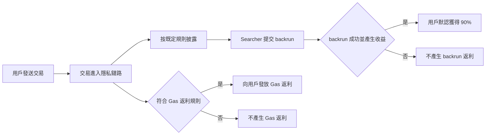

# Ethereum RPC 返利機制

使用 BlockRazor Ethereum RPC 發送交易時，交易可以在不進入公開 mempool 的情況下，按照已確定的披露規則進入私有訂單流。Searcher 根據被允許披露的信息，自行尋找 backrun 機會。如果 backrun 成功上鏈並產生收益，用戶默認可獲得 **90% 的可分配 backrun 收益**。

除 backrun 返利外，符合既定 Gas 返利規則的交易還可以獲得 **Gas 返利**。兩種返利來源相互獨立，一筆交易可能獲得其中一種、同時獲得兩種，或者不產生返利。

### 返利是怎樣產生的

1\. 用戶正常發送交易

用戶可以像使用普通 Ethereum RPC 一樣，通過 `eth_sendRawTransaction` 發送交易。BlockRazor Ethereum RPC 兼容標準 JSON-RPC 方法，不需要用戶改變交易本身。

2\. 按照既定規則披露交易信息

交易信息的披露範圍由接入時確定的規則控制。可配置的披露字段包括交易哈希、發送方、接收方、value、nonce、calldata 等。規則只允許披露已明確開放的字段，未開放的字段不會被披露。

3\. Searcher 自行尋找 backrun 機會

符合要求的 Searcher 可以訂閱被允許披露的交易信息，並根據這些信息自行分析交易，決定是否可以構建不損害用戶交易結果的 backrun 策略。

4\. Backrun 成功後向用戶返利

只有當用戶交易和 backrun 成功上鏈，且 backrun 實際產生收益時，才會進行收益分配。默認情況下，用戶獲得 **90% 的可分配 backrun 收益。**

5\. 符合規則的交易獲得 Gas 返利

Gas 返利與 backrun 返利是兩套不同的返利機制。符合既定 Gas 返利規則的交易，可以獲得相應的 Gas 費用返還，從而降低實際交易成本。

Gas 返利不依賴交易是否存在 backrun 機會。即使交易沒有產生 backrun 收益，只要符合 Gas 返利規則，仍然可以獲得 Gas 返利。

### 用戶需要做什麼

普通用戶只需要將錢包中的 Ethereum RPC 切換為 BlockRazor Ethereum RPC，然後按原有方式發送交易。是否有 Searcher 執行 backrun，以及交易是否符合 Gas 返利規則，都不需要用戶手動操作。

錢包、DEX 和其他項目方使用專屬 RPC 時，可以在接入階段確定交易信息披露規則、返利接收地址和其他返利配置。配置完成後，BlockRazor 會按照既定規則處理後續交易。

### 是否每筆交易都有返利

不是。兩類返利有不同的產生條件。

**Backrun 返利需要滿足**

* 交易按照既定規則進入私有訂單流
* Searcher 根據披露信息找到可執行的 backrun 機會
* Searcher 提交有效的 backrun
* 用戶交易和 backrun 成功上鏈
* backrun 實際產生可分配收益

**Gas 返利需要滿足**

* 用戶交易上鍊並產生符合要求的 Gas 支出

因此，返利不是固定獎勵，也不保證每筆交易都會產生。即使沒有返利，用戶交易仍會按照 BlockRazor Ethereum RPC 的提交路徑正常處理，並繼續獲得相應的隱私和惡意 MEV 防護。

### 返利什麼時候到賬

Backrun 成功上鏈並產生收益後，backrun 返利會按照既定規則實時進行分配。

Gas 返利則會根據交易執行結果和當前 Gas 返利策略進行處理。
